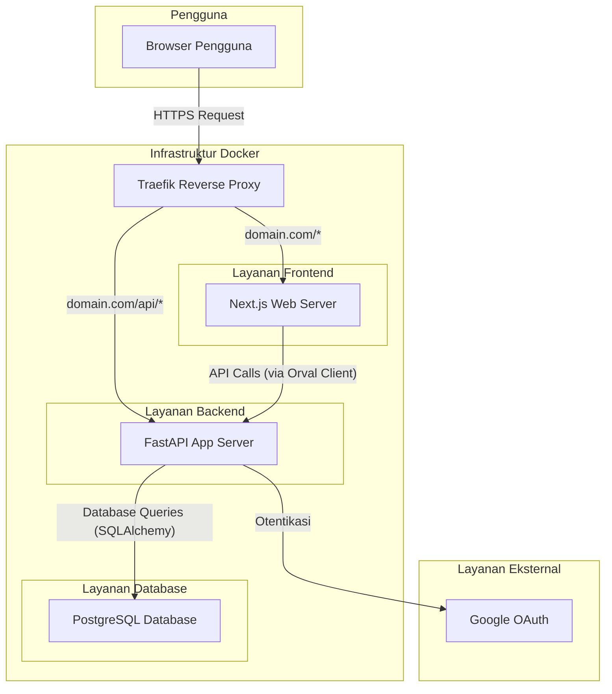

# Laporan Arsitektur Proyek IPBB

Dokumen ini menguraikan arsitektur teknis dari proyek IPBB. Proyek ini dibangun di atas tumpukan teknologi modern dengan pemisahan yang jelas antara backend dan frontend, serta diorkestrasi menggunakan Docker.

## Gambaran Umum

Aplikasi ini mengadopsi arsitektur **Client-Server** yang ter-containerisasi.

-   **Backend**: Sebuah API service yang dibangun dengan **FastAPI (Python)**, bertanggung jawab atas logika bisnis, interaksi database, dan otentikasi.
-   **Frontend**: Sebuah aplikasi web **Next.js (React/TypeScript)** yang menyediakan antarmuka pengguna (UI) yang interaktif dan modern.
-   **Reverse Proxy**: **Traefik** digunakan sebagai reverse proxy untuk mengarahkan trafik masuk ke layanan yang sesuai (frontend atau backend) dan menangani terminasi SSL.
-   **Database**: Menggunakan database relasional (kemungkinan besar **PostgreSQL**) yang dikelola oleh **SQLAlchemy** dan migrasi skema oleh **Alembic**.
-   **Containerization**: Seluruh aplikasi (backend, frontend, proxy) didefinisikan dalam `docker-compose.yml` untuk kemudahan pengembangan dan deployment yang konsisten.

---

## Diagram Arsitektur

Diagram berikut mengilustrasikan alur permintaan dan interaksi antar komponen utama dalam sistem.

---

## Detail Komponen

### 1. Backend (`/backend`)

Backend dibangun menggunakan Python dengan framework FastAPI yang terkenal karena kecepatan dan kemudahan pengembangan API.

-   **Framework**: **FastAPI** untuk membangun RESTful API yang efisien dan asinkron.
-   **Database & ORM**:
    -   **SQLAlchemy**: Sebagai Object-Relational Mapper (ORM) untuk berinteraksi dengan database secara aman dan terstruktur.
    -   **Alembic**: Untuk menangani migrasi skema database secara terversioning.
-   **Otentikasi**: Sistem otentikasi berbasis token (kemungkinan JWT) dengan dukungan untuk login sosial melalui **Google OAuth**.
-   **Struktur Kode**:
    -   `app/main.py`: Titik masuk utama aplikasi FastAPI.
    -   `app/models/`: Definisi model data SQLAlchemy.
    -   `app/routes/`: Logika untuk setiap endpoint API.
    -   `app/core/`: Konfigurasi inti, koneksi database, dan logika keamanan.
    -   `app/schemas/`: Skema Pydantic untuk validasi data request dan response.
-   **Kualitas Kode**: Menggunakan **Ruff** untuk linting dan **MyPy** untuk static type checking, memastikan kode yang bersih dan andal.

### 2. Frontend (`/frontend`)

Frontend adalah aplikasi Single Page Application (SPA) yang kaya fitur, dibangun dengan Next.js.

-   **Framework**: **Next.js (React)** dengan **TypeScript**, menggunakan **App Router** untuk routing modern.
-   **UI & Styling**:
    -   **shadcn/ui**: Pustaka komponen yang dapat dikomposisi.
    -   **Tailwind CSS**: Untuk styling utility-first yang cepat dan konsisten.
    -   **BiomeJS**: Sebagai formatter dan linter untuk menjaga kualitas kode.
-   **Komunikasi API**:
    -   **Orval**: Alat ini sangat penting. Orval digunakan untuk **menghasilkan klien API TypeScript yang type-safe** secara otomatis dari skema OpenAPI yang diekspos oleh backend FastAPI. Ini memastikan bahwa frontend dan backend selalu sinkron dalam hal kontrak API.
-   **Struktur Kode**:
    -   `app/`: Direktori utama untuk halaman dan layout (App Router).
    -   `components/`: Komponen React yang dapat digunakan kembali.
    -   `hooks/`: Custom hooks untuk logika stateful.
    -   `lib/orval/`: Tempat output dari klien API yang dihasilkan oleh Orval.

### 3. Containerization & DevOps

-   **Docker**: Setiap layanan (backend, frontend) memiliki `Dockerfile` sendiri untuk membangun image yang terisolasi.
-   **Docker Compose**: `docker-compose.yml` mengorkestrasi semua layanan ini untuk lingkungan pengembangan lokal, membuatnya mudah untuk dijalankan dengan satu perintah.
-   **Traefik**: Berfungsi sebagai "pintu gerbang" aplikasi. `traefik.yml` dan `docker-compose.yml` mengkonfigurasinya untuk:
    -   Mengarahkan permintaan ke `frontend` secara default.
    -   Mengarahkan permintaan yang dimulai dengan `/api` ke `backend`.
    -   Menangani sertifikat SSL secara otomatis (di lingkungan produksi).
-   **Deployment**: Adanya file `vercel.json` menunjukkan bahwa proyek ini juga dikonfigurasi untuk dapat di-deploy ke platform **Vercel**.
