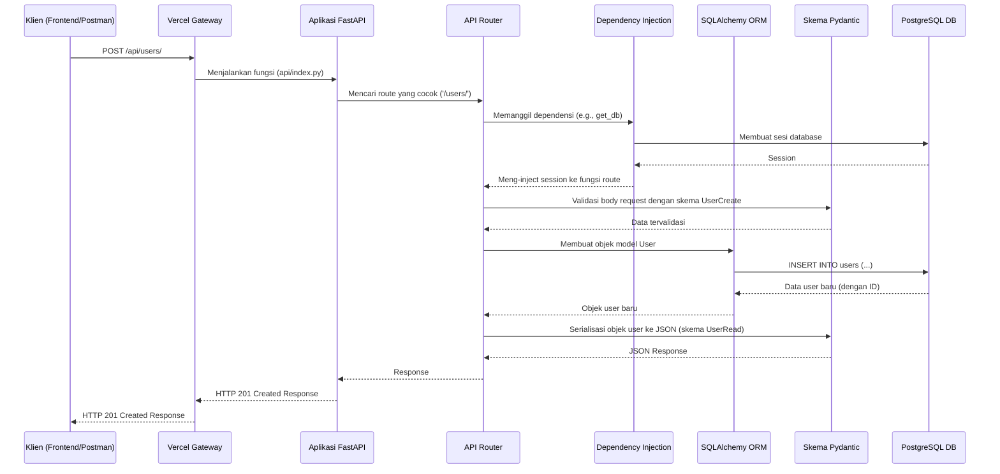

# Laporan Arsitektur Backend - Proyek IPBB

Dokumen ini memberikan analisis mendalam tentang arsitektur, komponen, dan alur kerja dari layanan backend proyek IPBB.

## 1. Pendahuluan

Backend dibangun menggunakan **Python** dengan framework **FastAPI**. Pilihan ini mengindikasikan fokus pada **performa tinggi**, **pengembangan cepat**, dan **keamanan tipe (type safety)** melalui penggunaan type hints Python. Arsitektur ini dirancang untuk menjadi modular, dapat diuji (testable), dan mudah untuk dikelola seiring pertumbuhan aplikasi.

## 2. Arsitektur & Filosofi Desain

Backend ini mengadopsi **Arsitektur Berlapis (Layered Architecture)** yang modern dan modular.

-   **API Layer (Routes)**: Lapisan terluar yang bertanggung jawab untuk mendefinisikan endpoint HTTP, menangani request, dan mengirim response. Didefinisikan di dalam `app/routes/` dan `app/auth/router.py`.
-   **Service/Business Logic Layer**: Meskipun tidak selalu dalam file terpisah, logika bisnis yang lebih kompleks (seperti dalam `app/auth/service.py`) dipisahkan dari logika routing. Ini mengelola proses bisnis inti.
-   **Data Access Layer (DAL)**: Terdiri dari model **SQLAlchemy** (`app/models/`) dan sesi database yang dikelola oleh `app/core/database.py`. Lapisan ini mengabstraksi semua interaksi dengan database.
-   **Core Services Layer**: Terdiri dari fungsionalitas inti yang digunakan di seluruh aplikasi, seperti konfigurasi (`config.py`), keamanan (`security.py`), dan dependensi (`deps.py`).

Filosofi utamanya adalah **Dependency Injection**, sebuah fitur inti dari FastAPI. Ketergantungan seperti sesi database (`get_db`) atau user yang terotentikasi (`get_current_user`) di-inject secara otomatis ke dalam fungsi route, membuat kode menjadi sangat modular, mudah diuji, dan eksplisit.

## 3. Diagram Alur Request (Request Flow)

Diagram sekuens berikut mengilustrasikan bagaimana sebuah permintaan API diproses dari awal hingga akhir.

## 4. Struktur Folder

Struktur folder dirancang untuk skalabilitas dan pemisahan tanggung jawab yang jelas.

-   `alembic/`: Konfigurasi dan skrip untuk **Alembic**, alat migrasi database.
    -   `versions/`: Setiap file di sini adalah versi migrasi skema database.
-   `app/`: Direktori utama yang berisi semua logika aplikasi.
    -   `__init__.py`: Menandakan `app` sebagai sebuah package Python.
    -   `main.py`: Titik masuk utama aplikasi FastAPI, tempat semua router digabungkan.
    -   `auth/`: Modul khusus untuk otentikasi (login, register, JWT, OAuth).
        -   `router.py`: Endpoint API untuk otentikasi.
        -   `service.py`: Logika bisnis otentikasi.
        -   `schemas.py`: Skema Pydantic khusus untuk data otentikasi.
        -   `oauth_google.py`: Logika spesifik untuk Google OAuth2.
    -   `core/`: Komponen inti yang digunakan di seluruh aplikasi.
        -   `config.py`: Manajemen konfigurasi menggunakan Pydantic's `BaseSettings` (memuat dari environment variables).
        -   `database.py`: Pengaturan koneksi dan sesi database SQLAlchemy.
        -   `deps.py`: Dependensi umum yang di-inject ke routes (misal: `get_db`).
        -   `security.py`: Fungsi untuk hashing password dan manajemen token JWT.
    -   `models/`: Definisi tabel database sebagai kelas Python menggunakan SQLAlchemy ORM.
    -   `routes/`: Modul-modul yang berisi endpoint API untuk setiap fitur (misal: `dashboard.py`, `items.py`).
    -   `schemas.py`: Skema Pydantic global untuk validasi data request/response.
-   `commands/`: Skrip CLI kustom untuk tugas-tugas pengembangan.
    -   `generate_openapi_schema.py`: Skrip penting untuk mengekspor skema OpenAPI dari FastAPI, yang kemudian digunakan oleh `orval` di frontend.
-   `tests/`: Berisi semua tes otomatis. Strukturnya mencerminkan struktur `app/` untuk kemudahan navigasi.
    -   `conftest.py`: Fixtures dan konfigurasi untuk Pytest.
-   `api/index.py`: Titik masuk untuk deployment di **Vercel** (lingkungan serverless). File ini mengimpor dan menjalankan aplikasi FastAPI.
-   `pyproject.toml`: File konfigurasi proyek standar Python. Mendefinisikan dependensi, metadata proyek, dan konfigurasi untuk alat seperti **Ruff** dan **MyPy**.
-   `uv.lock`: Lock file yang dihasilkan oleh **uv**, memastikan instalasi dependensi yang konsisten dan cepat.
-   `Dockerfile`: Instruksi untuk membangun image Docker dari layanan backend.

## 5. Pustaka Kunci & Dependensi

-   **FastAPI**: Framework web asinkron untuk membangun API.
-   **Uvicorn**: Server ASGI (Asynchronous Server Gateway Interface) untuk menjalankan FastAPI.
-   **Pydantic**: Untuk validasi data, serialisasi, dan manajemen konfigurasi. Merupakan tulang punggung dari FastAPI.
-   **SQLAlchemy**: ORM utama untuk berinteraksi dengan database SQL.
-   **Alembic**: Untuk menangani migrasi skema database secara terprogram.
-   **uv**: Pengelola paket dan virtual environment yang sangat cepat, digunakan sebagai pengganti `pip` dan `venv`.
-   **python-jose** & **passlib**: Untuk menangani pembuatan dan validasi token JWT serta hashing password.
-   **Ruff**: Linter dan formatter kode Python yang sangat cepat.
-   **MyPy**: Untuk pengecekan tipe statis (static type checking).
-   **Pytest**: Framework untuk pengujian otomatis (unit & integration tests).

## 6. Alur Kerja Pengembangan & Integrasi Frontend

Alur kerja untuk menambahkan atau mengubah endpoint API dirancang agar sinkronisasi dengan frontend berjalan mulus:

1.  **Backend Dev**: Pengembang membuat atau mengubah endpoint di `app/routes/`, beserta model (`app/models/`) dan skema (`app/schemas/`) yang diperlukan.
2.  **Jalankan Tes**: Pengembang menjalankan `pytest` untuk memastikan tidak ada regresi.
3.  **Generate OpenAPI Schema**: Pengembang menjalankan perintah `python -m commands.generate_openapi_schema`. Ini akan membuat/memperbarui file `openapi.json`.
4.  **Commit Perubahan**: Perubahan kode backend dan `openapi.json` di-commit ke repository.
5.  **Frontend Dev**: Tim frontend menarik perubahan terbaru.
6.  **Generate API Client**: Tim frontend menjalankan `npm run orval` (atau perintah sejenis). Orval akan membaca `openapi.json` yang baru dan secara otomatis menghasilkan ulang klien API TypeScript yang sudah type-safe.
7.  **Gunakan di Frontend**: Frontend sekarang dapat menggunakan fungsi-fungsi API yang baru atau yang telah diubah dengan jaminan type safety.

Alur ini secara signifikan mengurangi bug integrasi antara backend dan frontend.
