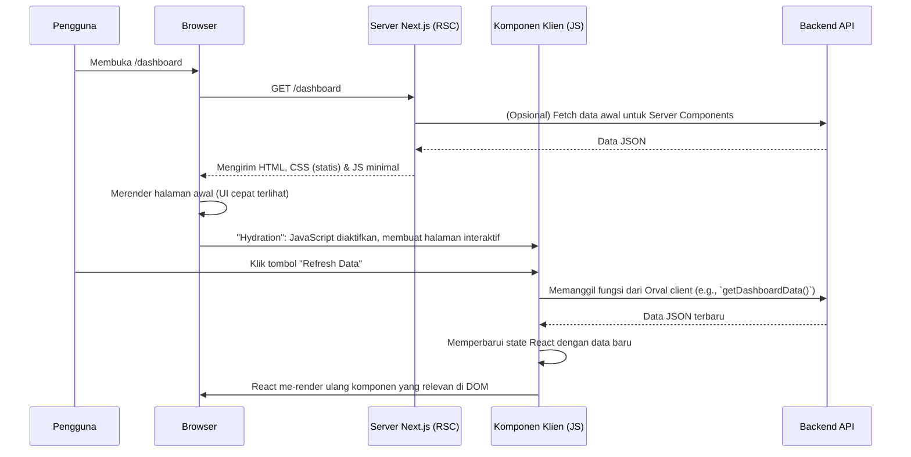

# Laporan Arsitektur Frontend - Proyek IPBB

Dokumen ini menyajikan analisis mendalam tentang arsitektur, tumpukan teknologi, pola desain, dan alur kerja pengembangan untuk aplikasi frontend proyek IPBB.

## 1. Pendahuluan & Filosofi

Frontend aplikasi ini adalah **Single Page Application (SPA)** yang modern dan sangat interaktif, dibangun di atas **Next.js 14+** dengan **React** dan **TypeScript**. Filosofi utamanya adalah menciptakan pengalaman pengguna yang cepat, responsif, dan andal, sambil memastikan kode tetap terstruktur, dapat dipelihara, dan sangat aman dari segi tipe (type-safe).

Arsitektur ini berpusat pada tiga pilar utama:
1.  **Kinerja**: Menggunakan fitur-fitur terbaru Next.js seperti **App Router** dengan **React Server Components (RSC)** untuk meminimalkan jejak JavaScript di sisi klien dan mempercepat waktu muat awal.
2.  **Pengalaman Pengembang (Developer Experience)**: Otomatisasi dan alat bantu modern seperti BiomeJS, TypeScript, dan Orval digunakan untuk mempercepat pengembangan, mengurangi bug, dan menjaga konsistensi kode.
3.  **Desain Modular**: Mengadopsi pendekatan berbasis komponen yang kuat, memisahkan antara komponen UI primitif, komponen aplikasi yang lebih kompleks, dan logika bisnis.

## 2. Tumpukan Teknologi (Tech Stack)

-   **Framework**: **Next.js (v14+)** dengan **App Router**.
-   **Bahasa**: **TypeScript**.
-   **UI Library**: **React**.
-   **Styling**:
    -   **Tailwind CSS**: Framework CSS utility-first untuk desain yang cepat dan konsisten.
    -   **shadcn/ui**: Pustaka komponen yang tidak memiliki gaya visual bawaan (unstyled), dapat dikomposisi, dan aksesibel. Komponen ini ditambahkan langsung ke dalam codebase (`components/ui`) untuk kustomisasi penuh.
    -   **PostCSS**: Alat untuk mentransformasi CSS dengan plugin.
-   **Manajemen State**:
    -   **React Hooks (`useState`, `useContext`)**: Untuk state lokal dan state sederhana yang dibagikan.
    -   **Server State Management**: Kemungkinan besar menggunakan **TanStack Query (React Query)**, yang sering dipasangkan dengan Orval, untuk mengelola caching, re-fetching, dan sinkronisasi data dari API backend.
-   **Klien API**: **Orval** untuk menghasilkan klien API TypeScript yang sepenuhnya type-safe dari skema OpenAPI backend.
-   **Kualitas Kode**:
    -   **BiomeJS**: Alat performa tinggi untuk linting dan formatting, memastikan kode bersih dan konsisten.
    -   **ESLint**: Linter tambahan untuk aturan-aturan spesifik.
    -   **TypeScript**: Menerapkan type safety di seluruh aplikasi.
-   **Tabel & Data Grid**: **TanStack Table (React Table)**, seperti yang terlihat dari `components/data-table.tsx`, untuk membangun tabel data yang kuat dan dapat disesuaikan.

## 3. Diagram Alur Rendering & Interaksi Pengguna

Diagram ini mengilustrasikan siklus hidup sebuah halaman, dari permintaan awal hingga interaksi pengguna di sisi klien.



## 4. Struktur Folder yang Mendalam

Struktur folder dioptimalkan untuk **Next.js App Router** dan skalabilitas.

-   `app/`: Inti dari aplikasi, di mana setiap folder mewakili sebuah route.
    -   `layout.tsx`: Layout root yang membungkus seluruh aplikasi. Di sinilah `ThemeProvider`, `ClientProvider`, dan konteks global lainnya diinisialisasi.
    -   `page.tsx`: Halaman utama (homepage) aplikasi.
    -   `globals.css`: Gaya global yang diterapkan di mana saja.
    -   `(group)/`: Penggunaan folder dalam kurung `()` menunjukkan **Route Group**. Ini digunakan untuk mengorganisir route tanpa memengaruhi URL. Contohnya, `(auth)/login` akan diakses di `/login`.
    -   `dashboard/`, `login/`, `profile/`: Setiap folder ini adalah sebuah route.
        -   `page.tsx`: Komponen utama (UI) untuk route tersebut. Bisa berupa Server Component atau Client Component.
        -   `loading.tsx`: (Jika ada) UI loading otomatis yang ditampilkan saat data untuk `page.tsx` sedang di-fetch.
        -   `error.tsx`: (Jika ada) UI fallback yang ditampilkan jika terjadi error.
-   `components/`: Komponen React yang dapat digunakan kembali.
    -   `ui/`: Komponen "primitif" yang disediakan oleh **shadcn/ui** (misalnya, `Button.tsx`, `Card.tsx`). Ini adalah blok bangunan dasar UI.
    -   `app-sidebar.tsx`, `site-header.tsx`: Komponen "komposit" atau "aplikasi" yang dibangun dari beberapa komponen primitif dan memiliki logika spesifik untuk aplikasi ini.
    -   `layouts/`: Komponen yang mendefinisikan struktur tata letak halaman tertentu.
-   `hooks/`: Custom React Hooks untuk mengekstrak dan menggunakan kembali logika stateful.
    -   `use-debounce.ts`: Contoh bagus untuk menunda eksekusi fungsi (berguna untuk input pencarian).
    -   `use-mobile.ts`: Hook untuk mendeteksi apakah pengguna berada di perangkat mobile.
-   `lib/`: Folder untuk fungsi utilitas, konfigurasi library, dan kode yang dihasilkan.
    -   `utils.ts`: (Jika ada) Fungsi pembantu umum (misalnya, format tanggal, `cn` untuk menggabungkan kelas Tailwind).
    -   `orval/`: **Direktori Kritis**. Berisi klien API TypeScript yang dihasilkan secara otomatis oleh Orval. Pengembang **tidak boleh** mengedit file di sini secara manual.
-   `services/`: Lapisan abstraksi untuk berinteraksi dengan layanan eksternal.
    -   `api/`: Kemungkinan berisi konfigurasi atau instance dari klien API yang dihasilkan Orval (misalnya, menambahkan interceptor untuk token otentikasi).
-   `public/`: Untuk aset statis seperti gambar (`sppt.jpg`), ikon (`favicon.ico`), dan file SVG. Aset di sini dapat diakses langsung dari URL root.
-   `middleware.ts`: File middleware Next.js. Fungsinya sangat penting untuk **menjalankan kode sebelum sebuah permintaan selesai**. Kasus penggunaan umum di sini adalah:
    -   **Melindungi Route**: Memeriksa apakah pengguna memiliki token otentikasi di cookie. Jika tidak, mengalihkannya ke halaman `/login`.
    -   **Redirects & Rewrites**: Mengarahkan ulang URL berdasarkan kondisi tertentu.
-   `orval.config.ts`: File konfigurasi untuk **Orval**. Ini memberitahu Orval di mana menemukan `openapi.json` dari backend, ke mana harus mengeluarkan klien yang dihasilkan (`lib/orval`), dan bagaimana cara memformatnya.

## 5. Alur Kerja Integrasi Backend (Orval Workflow)

Ini adalah salah satu bagian paling canggih dari arsitektur frontend.

1.  **Sinkronisasi**: Pengembang frontend mengambil perubahan terbaru dari repositori, yang mencakup `openapi.json` yang diperbarui oleh tim backend.
2.  **Instalasi Dependensi**: Menjalankan `npm install` atau `pnpm install` untuk memastikan semua pustaka terbaru.
3.  **Pembuatan Klien**: Pengembang menjalankan skrip `npm run orval` (atau nama skrip yang sesuai di `package.json`).
4.  **Proses Orval**:
    -   Orval membaca `orval.config.ts`.
    -   Ia mengambil file `openapi.json` dari lokasi yang ditentukan (bisa berupa path lokal atau URL).
    -   Ia menganalisis semua endpoint, skema, dan tipe data dari API backend.
    -   Ia menghasilkan serangkaian file TypeScript di `lib/orval/` yang berisi:
        -   Fungsi untuk setiap endpoint API (misalnya, `getUsers`, `createUser`).
        -   Interface atau Tipe TypeScript untuk setiap skema Pydantic dari backend.
        -   (Opsional) Hook React Query yang sudah jadi untuk setiap endpoint GET.
5.  **Penggunaan di Kode**: Pengembang sekarang dapat mengimpor fungsi-fungsi ini di komponen React mereka.
    ```typescript
    import { useGetItems } from '@/lib/orval'; // Contoh hook yang dihasilkan

    function ItemList() {
      const { data, isLoading, error } = useGetItems();

      if (isLoading) return <div>Loading...</div>;
      // ...
    }
    ```
    Keuntungannya adalah jika backend mengubah nama field atau tipe data, `tsc` (TypeScript Compiler) akan langsung **menghasilkan error saat build**, mencegah bug runtime.

## 6. Kualitas Kode dan Konvensi

Proyek ini menunjukkan komitmen yang kuat terhadap kualitas kode melalui:
-   **Formatting & Linting Otomatis**: `biome.json` dan `eslint.config.mjs` memastikan semua kode yang di-commit memiliki gaya yang seragam dan mematuhi praktik terbaik.
-   **Strict TypeScript**: `tsconfig.json` kemungkinan dikonfigurasi untuk mode `strict`, memaksa pengembang untuk menangani `null` dan `undefined` secara eksplisit, yang secara drastis mengurangi bug.
-   **Konvensi Penamaan**: Struktur folder dan nama file (misalnya, `app-sidebar.tsx`, `use-debounce.ts`) mengikuti konvensi standar komunitas React/Next.js, membuatnya mudah dinavigasi oleh pengembang baru.
