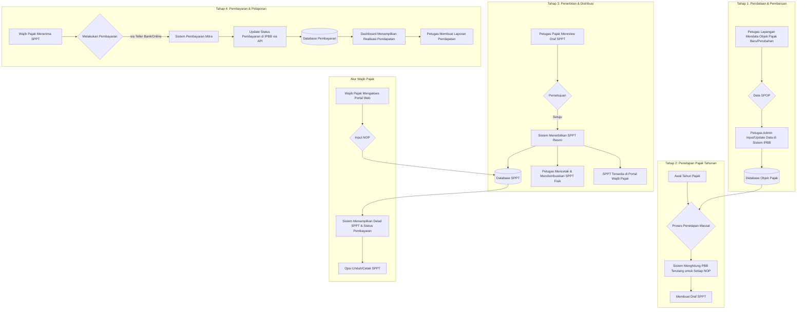

# Narasi Proyek dan Alur Bisnis: Sistem Informasi Pajak Bumi dan Bangunan (IPBB)

## 1. Visi dan Latar Belakang

**Masalah yang Diselesaikan:**

Di banyak pemerintah daerah, proses pengelolaan Pajak Bumi dan Bangunan (PBB) masih bersifat semi-manual, terfragmentasi, dan tidak efisien. Data objek pajak tersimpan dalam spreadsheet atau sistem lawas yang terisolasi, proses penerbitan surat pajak (SPPT) memakan waktu dan rentan terhadap kesalahan, dan wajib pajak (masyarakat) kesulitan mendapatkan informasi tagihan mereka secara cepat dan transparan. Hal ini menyebabkan potensi kehilangan pendapatan daerah, ketidakpuasan publik, dan kesulitan dalam perencanaan pembangunan berbasis data.

**Visi Proyek IPBB:**

Proyek IPBB (Sistem Informasi Pajak Bumi dan Bangunan) lahir sebagai solusi untuk mentransformasi proses ini secara digital. Visinya adalah untuk menciptakan sebuah **platform terpusat, modern, dan terintegrasi** yang mengelola seluruh siklus hidup PBB—mulai dari pendaftaran objek pajak hingga pelaporan pendapatan—secara efisien, akurat, dan transparan.

**Target Pengguna:**

Sistem ini dirancang untuk melayani dua kelompok pengguna utama:

1.  **Internal (Petugas Pajak / Admin Pemerintah Daerah):** Mereka yang bertugas mengelola data, melakukan verifikasi, menetapkan pajak, menerbitkan SPPT, dan memantau pembayaran.
2.  **Eksternal (Wajib Pajak / Masyarakat):** Mereka yang memiliki properti dan berkewajiban membayar PBB. Mereka membutuhkan akses mudah untuk melihat tagihan, riwayat, dan informasi terkait properti mereka.

## 2. Deskripsi Fungsional Sistem

IPBB adalah aplikasi web komprehensif yang terdiri dari dua bagian utama yang saling terhubung: **Backend API** yang kuat sebagai otak operasi dan **Frontend Dashboard** yang intuitif sebagai antarmuka pengguna.

**Modul-Modul Utama:**

- **Dashboard Analitik:** Halaman utama bagi petugas pajak, menampilkan Key Performance Indicators (KPI) secara visual. Contohnya: total target PBB, total PBB yang sudah dibayar, jumlah objek pajak baru, dan tren pendapatan dari tahun ke tahun.
- **Manajemen Objek Pajak (SPOP):** Fitur untuk mendaftarkan, melihat, dan memperbarui data properti (tanah dan bangunan). Ini adalah implementasi digital dari "Surat Pemberitahuan Objek Pajak" (SPOP). Setiap properti akan memiliki Nomor Objek Pajak (NOP) yang unik sebagai identitasnya.
- **Penilaian dan Penetapan Pajak:** Sistem secara otomatis menghitung Nilai Jual Objek Pajak (NJOP) berdasarkan zona nilai tanah dan data bangunan, kemudian mengalikannya dengan tarif yang berlaku untuk menetapkan jumlah PBB yang terutang.
- **Penerbitan dan Pencetakan SPPT:** Jantung dari sistem ini. Petugas dapat menerbitkan "Surat Pemberitahuan Pajak Terutang" (SPPT) secara massal untuk semua objek pajak pada awal tahun pajak, atau secara individual sesuai kebutuhan. Sistem ini juga menyediakan fitur untuk mencetak SPPT dalam format standar.
- **Manajemen Wajib Pajak:** Mengelola data pemilik properti (subjek pajak), termasuk riwayat kepemilikan dan informasi kontak.
- **Portal Wajib Pajak:** Antarmuka publik yang memungkinkan masyarakat untuk mengecek tagihan SPPT mereka secara online hanya dengan memasukkan NOP.
- **Manajemen Pengguna dan Otentikasi:** Sistem otentikasi yang aman untuk petugas pajak, menggunakan integrasi dengan Google OAuth untuk kemudahan dan keamanan login.

## 3. Alur Bisnis (Business Flow)

Alur bisnis utama menggambarkan bagaimana sistem ini digunakan dalam siklus tahunan pengelolaan PBB.

### Skenario Penggunaan Tipikal:

1.  **Pendaftaran Properti Baru:**

    - Seorang warga membeli sebidang tanah dan membangun rumah.
    - Warga tersebut melapor ke kantor pajak daerah dengan membawa dokumen.
    - Petugas admin membuka modul **Manajemen Objek Pajak** di sistem IPBB.
    - Petugas menginput semua detail dari formulir SPOP: data pemilik, alamat, luas tanah, luas bangunan, jenis bangunan, dll.
    - Sistem memvalidasi data dan menghasilkan **Nomor Objek Pajak (NOP)** baru. Data tersimpan.

2.  **Penerbitan SPPT Tahunan:**

    - Pada bulan Januari, kepala dinas pendapatan memerintahkan penerbitan SPPT untuk tahun berjalan.
    - Petugas admin membuka modul **Penerbitan SPPT** dan memulai proses "Penetapan Massal".
    - Sistem melakukan iterasi pada setiap objek pajak aktif di database.
    - Untuk setiap objek, sistem menghitung PBB terutang berdasarkan aturan yang telah ditetapkan.
    - Setelah selesai, ribuan draf SPPT siap untuk direview.
    - Setelah disetujui, petugas menekan tombol "Terbitkan Semua". Status SPPT menjadi "resmi" dan tagihan muncul di portal wajib pajak.

3.  **Warga Mengecek Tagihan:**
    - Ibu Ani ingin tahu berapa tagihan PBB rumahnya tahun ini.
    - Ia membuka situs web pemerintah daerah dan masuk ke **Portal Cek PBB**.
    - Ia memasukkan 18 digit NOP yang tertera pada SPPT tahun lalu.
    - Sistem langsung menampilkan gambar SPPT tahun ini, lengkap dengan jumlah tagihan, tanggal jatuh tempo, dan status "Belum Dibayar". Ia bisa langsung mengunduh file PDF-nya.

## 4. Manfaat dan Dampak Strategis

Implementasi proyek IPBB memberikan manfaat signifikan:

- **Untuk Pemerintah Daerah:**

  - **Peningkatan Pendapatan:** Mengurangi kebocoran pajak melalui pendataan yang lebih akurat dan pemantauan yang lebih baik.
  - **Efisiensi Operasional:** Mengotomatiskan tugas-tugas manual yang memakan waktu (perhitungan, penerbitan SPPT).
  - **Data Terpusat & Akurat:** Menciptakan satu sumber kebenaran (single source of truth) untuk data PBB, yang dapat digunakan untuk analisis dan perencanaan pembangunan.
  - **Peningkatan Akuntabilitas:** Setiap perubahan data tercatat, mengurangi risiko penyelewengan.

- **Untuk Masyarakat (Wajib Pajak):**
  - **Transparansi:** Kemudahan mengakses informasi tagihan dan riwayat pembayaran.
  - **Kenyamanan:** Tidak perlu lagi datang ke kantor pajak hanya untuk mengetahui jumlah tagihan.
  - **Kepastian Hukum:** Mendapatkan dokumen SPPT resmi secara cepat dan mudah.

Secara keseluruhan, IPBB bukan hanya sebuah proyek IT. Ini adalah sebuah **instrumen reformasi birokrasi** di bidang pelayanan publik, mendorong pemerintah daerah menjadi lebih modern, efisien, dan akuntabel.
